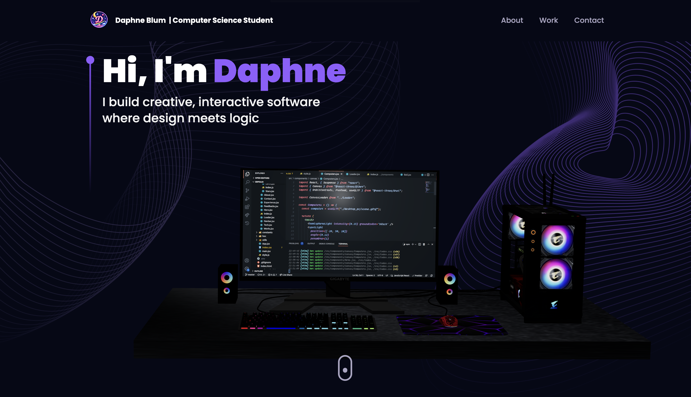
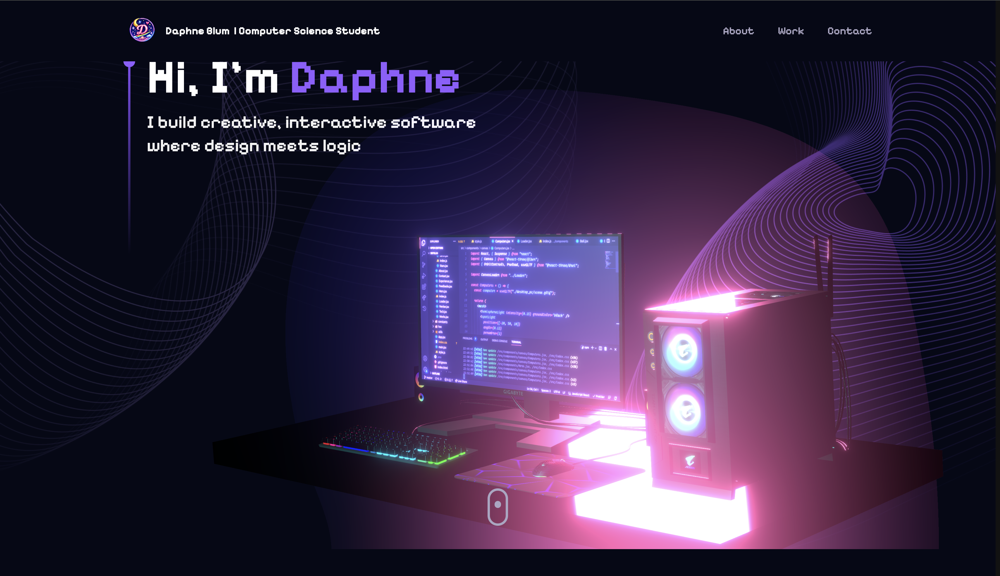

# Personal Portfolio 🌸

An interactive 3D developer portfolio built with React and Three.js, featuring animated 3D scenes, smooth scroll animations, and a fully customized visual aesthetic.

---

## 📸 Screenshots




## ✨ Features

- **3D Interactive Hero** — A customized 3D desktop scene with dynamic pink/purple lighting and a glowing monitor
- **Animated Timeline** — Work experience displayed in an interactive vertical timeline
- **Project Cards** — Tilt-effect project cards with GitHub links
- **Tech Stack Badges** — Rotating 3D ball icons showcasing technologies
- **Working Contact Form** — EmailJS-powered contact form with a 3D crystal island scene
- **Scroll Animations** — Smooth entrance animations powered by Framer Motion
- **Fully Responsive** — Adapts to mobile and desktop screen sizes
- **Starfield Background** — Animated star canvas on the contact section

---

## 🛠️ Technologies Used

- **React** — Frontend framework
- **Three.js** — 3D rendering
- **React Three Fiber** — React renderer for Three.js
- **React Three Drei** — Useful helpers for React Three Fiber
- **Framer Motion** — Scroll and entrance animations
- **Tailwind CSS** — Utility-first styling
- **EmailJS** — Contact form email handling
- **Vite** — Build tool and dev server

---

## 🚀 Setup

### Prerequisites
- Node.js
- npm

### Installation

```bash
# Clone the repository
git clone https://github.com/daphneblum/portfolio.git

# Navigate into the project
cd portfolio

# Install dependencies
npm install

# Create a .env file in the root directory and add your EmailJS credentials
VITE_APP_EMAILJS_SERVICE_ID=your_service_id
VITE_APP_EMAILJS_TEMPLATE_ID=your_template_id
VITE_APP_EMAILJS_PUBLIC_KEY=your_public_key
VITE_APP_EMAIL=your@email.com

# Start the development server
npm run dev
```

---

## 🙏 Credits

- 3D Desktop Model — [Sketchfab](https://sketchfab.com/3d-models/gaming-desktop-pc-d1d8282c9916438091f11aeb28787b66)
- 3D Crystal Island Model — [Sketchfab](https://sketchfab.com/3d-models/crystal-planet-7a95246b6eda448d98a236b91474bcbb)
- Tutorial — [JS Mastery](https://www.youtube.com/@javascriptmastery) — *Build and Deploy an Amazing 3D Web Developer Portfolio in React JS*
- Fonts — [Google Fonts](https://fonts.google.com/specimen/Pixelify+Sans) (Pixelify Sans)

---

## 👩‍💻 About

Built by **Daphne Blum** — Computer Science Student at Western Governors University.

[](https://github.com/daphneblum)


This template provides a minimal setup to get React working in Vite with HMR and some ESLint rules.

Currently, two official plugins are available:

- [@vitejs/plugin-react](https://github.com/vitejs/vite-plugin-react/blob/main/packages/plugin-react) uses [Oxc](https://oxc.rs)
- [@vitejs/plugin-react-swc](https://github.com/vitejs/vite-plugin-react/blob/main/packages/plugin-react-swc) uses [SWC](https://swc.rs/)

## React Compiler

The React Compiler is not enabled on this template because of its impact on dev & build performances. To add it, see [this documentation](https://react.dev/learn/react-compiler/installation).

## Expanding the ESLint configuration

If you are developing a production application, we recommend using TypeScript with type-aware lint rules enabled. Check out the [TS template](https://github.com/vitejs/vite/tree/main/packages/create-vite/template-react-ts) for information on how to integrate TypeScript and [`typescript-eslint`](https://typescript-eslint.io) in your project.
